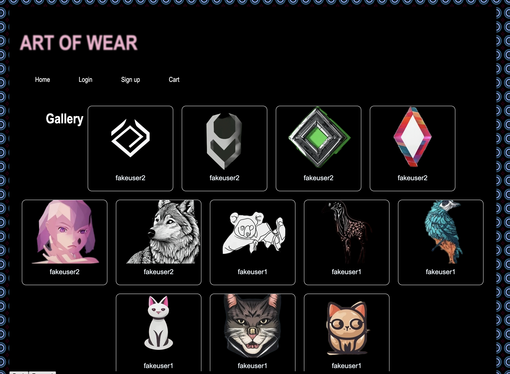

# ART OF WEAR

## Description
AS an Artist who creates Art 
I WANT be able to upload my art and get paid for it.  
SO THAT other users can buy my ary and wear it on thier clothes
## Technologies Used
- [Mongoose]
- [Express]
- [React]
- [Node.js]

## Deployed Application
[Deployed Application](https://art-of-wear.onrender.com/)

[Github Repo link](https://github.com/PeytonBrimmer/ART-OF-WEAR/)

## Screenshot

## Contributing
Contributions are welcome! Please submit a pull request.

## Authors
* [Taaj Logan](https://github.com/TaajL) 

* [Peyton Brimmer](https://github.com/PeytonBrimmer) 

* [Dan Patoneil ](https://github.com/danpatoneil) 

## Credits
N/A

## License
This project is released under the MIT License. See the LICENSE file for details.

